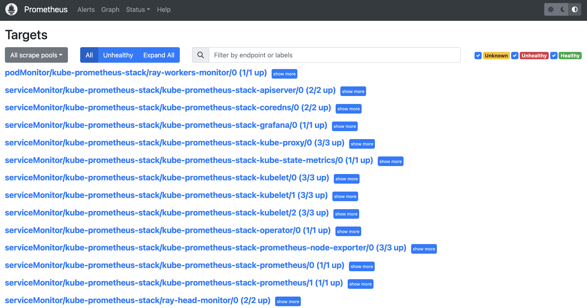
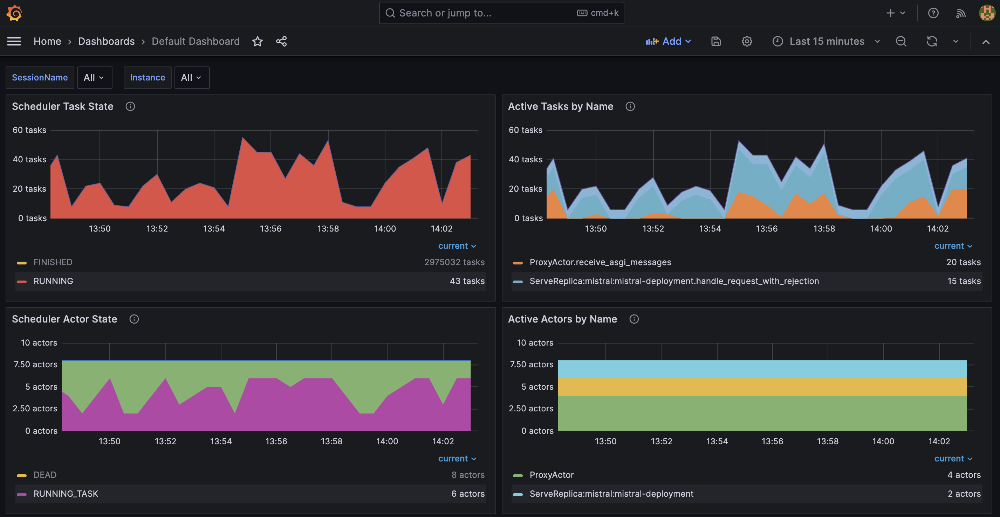

import CollapsibleContent from '../../../../../../../src/components/CollapsibleContent';

:::caution

**EKS上的AI**内容**正在迁移**到一个新的仓库。
🔗 👉 [阅读完整的迁移公告 »](https://awslabs.github.io/data-on-eks/docs/migration/migration-announcement)

:::

:::warning
在EKS上部署ML模型需要访问GPU或Neuron实例。如果您的部署不起作用，通常是因为缺少对这些资源的访问。此外，一些部署模式依赖于Karpenter自动扩展和静态节点组；如果节点未初始化，请检查Karpenter或节点组的日志以解决问题。
:::

:::caution

使用[Mistralai/Mistral-7B-Instruct-v0.2](https://huggingface.co/mistralai/Mistral-7B-Instruct-v0.2)模型需要通过Hugging Face账户访问。

:::


# 使用RayServe和vLLM部署LLM

在本指南中，我们将探索使用[Ray Serve](https://docs.ray.io/en/latest/serve/getting_started.html)和[vLLM](https://github.com/vllm-project/vllm)后端在Amazon EKS（弹性Kubernetes服务）上部署大型语言模型（LLM）。我们将使用`mistralai/Mistral-7B-Instruct-v0.2`模型来演示这种模式。

使用带有vLLM后端的Ray Serve进行LLM推理提供了几个令人信服的好处，特别是在可扩展性、效率和易于部署方面。Ray Serve设计用于高效处理并发请求，使其非常适合需要同时处理多个请求的实时应用程序。它支持动态批处理，将多个请求分组在一起以优化吞吐量和资源利用率，这对于处理LLM推理的高需求至关重要。此外，Ray Serve基于传入请求负载自动扩展的能力确保了资源的最佳使用，无需手动干预即可适应不同的流量。与vLLM的集成进一步增强了性能，利用vLLM的实时批处理功能，这对于高效的在线推理至关重要。此外，Ray Serve的框架无关性使其可以与任何Python框架一起使用，提供了模型部署的灵活性和与现有系统的集成。这些功能的组合使Ray Serve与vLLM后端成为在生产环境中部署大型语言模型的强大解决方案，确保高性能、可扩展性和易用性。

## RayServe和vLLM后端集成

**[vLLM](https://github.com/vllm-project/vllm)**：是一个高吞吐量和内存高效的大型语言模型（LLM）推理和服务引擎，专门设计用于优化部署和推理性能。一个突出的特点是PagedAttention，这是一种受操作系统虚拟内存分页启发的创新注意力算法。PagedAttention通过将注意力键和值张量（KV缓存）存储在非连续内存空间中，有效管理它们，这显著减少了内存碎片和浪费。查看[博客](https://blog.vllm.ai/2023/06/20/vllm.html)，比较vLLM与HuggingFace Transformers（HF）和HuggingFace Text Generation Inference（TGI）。

vLLM采用传入请求的连续批处理，通过将多个请求分组在一起，优化计算资源的使用并提高推理速度。这种动态批处理最大化了吞吐量并减少了延迟。该引擎还具有优化的CUDA内核，用于在GPU上加速模型执行。另一个关键优势是vLLM在并行采样期间的高效内存共享，其中从单个提示生成多个输出序列。这减少了高达55%的内存使用，并将吞吐量提高了高达2.2倍。

### Mistralai/Mistral-7B-Instruct-v0.2
在本指南中，我们使用RayServe和vLLM部署Mistral-7B-Instruct-v0.2模型。您可以轻松调整这些说明来部署任何大型语言模型，如Llama2。Mistral-7B-Instruct-v0.2是一个最先进的大型语言模型，旨在提供高质量、有指导性的响应。它在多样化的数据集上训练，擅长理解和生成各种主题的类人文本，使其适用于需要详细解释、复杂查询和自然语言理解的应用程序。
<CollapsibleContent header={<h2><span>部署解决方案</span></h2>}>

我们使用Terraform基础设施即代码（IaC）模板来部署Amazon EKS集群，并在使用RayServe YAML配置部署模型时使用Karpenter动态扩展GPU节点。

要开始在Amazon EKS上部署mistralai/Mistral-7B-Instruct-v0.2，本指南将涵盖必要的先决条件，并一步步引导您完成部署过程。此过程包括设置基础设施、部署Ray集群，以及创建向RayServe端点发送HTTP请求进行推理的客户端Python应用程序。


:::danger

重要提示：在`g5.8xlarge`实例上部署可能会很昂贵。确保您仔细监控和管理您的使用情况，以避免意外成本。考虑设置预算警报和使用限制来跟踪您的支出。

:::

### 先决条件
在我们开始之前，请确保您已经准备好所有必要的先决条件，以使部署过程顺利进行。确保您已在计算机上安装了以下工具：

:::info

为了简化演示过程，我们假设使用具有管理权限的IAM角色，因为为每个可能创建各种AWS服务的蓝图创建最小IAM角色的复杂性。但是，对于生产部署，强烈建议创建只具有必要权限的IAM角色。使用[IAM Access Analyzer](https://aws.amazon.com/iam/access-analyzer/)等工具可以帮助确保最小权限方法。

:::

1. [aws cli](https://docs.aws.amazon.com/cli/latest/userguide/install-cliv2.html)
2. [kubectl](https://Kubernetes.io/docs/tasks/tools/)
3. [terraform](https://learn.hashicorp.com/tutorials/terraform/install-cli)
4. [envsubst](https://pypi.org/project/envsubst/)

### 部署

克隆仓库

```bash
git clone https://github.com/awslabs/data-on-eks.git
```

**重要提示：**

**步骤1**：确保在部署蓝图之前更新`variables.tf`文件中的区域。
此外，确认您的本地区域设置与指定区域匹配，以防止任何差异。

例如，将您的`export AWS_DEFAULT_REGION="<REGION>"`设置为所需区域：


**步骤2**：运行安装脚本。

```bash
cd data-on-eks/ai-ml/jark-stack/terraform && chmod +x install.sh
```

```bash
./install.sh
```

### 验证资源

安装完成后，验证Amazon EKS集群。

创建k8s配置文件以与EKS进行身份验证。

```bash
aws eks --region us-west-2 update-kubeconfig --name jark-stack
```

```bash
kubectl get nodes
```

```text
NAME                                           STATUS   ROLES    AGE    VERSION
ip-100-64-118-130.us-west-2.compute.internal   Ready    <none>   3h9m   v1.30.0-eks-036c24b
ip-100-64-127-174.us-west-2.compute.internal   Ready    <none>   9h     v1.30.0-eks-036c24b
ip-100-64-132-168.us-west-2.compute.internal   Ready    <none>   9h     v1.30.0-eks-036c24b
```

验证Karpenter自动缩放器节点池

```bash
kubectl get nodepools
```

```text
NAME                NODECLASS
g5-gpu-karpenter    g5-gpu-karpenter
x86-cpu-karpenter   x86-cpu-karpenter
```

验证NVIDIA设备插件

```bash
kubectl get pods -n nvidia-device-plugin
```
```text
NAME                                                              READY   STATUS    RESTARTS   AGE
nvidia-device-plugin-gpu-feature-discovery-b4clk                  1/1     Running   0          3h13m
nvidia-device-plugin-node-feature-discovery-master-568b49722ldt   1/1     Running   0          9h
nvidia-device-plugin-node-feature-discovery-worker-clk9b          1/1     Running   0          3h13m
nvidia-device-plugin-node-feature-discovery-worker-cwg28          1/1     Running   0          9h
nvidia-device-plugin-node-feature-discovery-worker-ng52l          1/1     Running   0          9h
nvidia-device-plugin-p56jj                                        1/1     Running   0          3h13m
```

验证Kuberay Operator，它用于创建Ray集群

```bash
kubectl get pods -n kuberay-operator
```

```text
NAME                                READY   STATUS    RESTARTS   AGE
kuberay-operator-7894df98dc-447pm   1/1     Running   0          9h
```

</CollapsibleContent>

## 使用RayServe和vLLM部署Mistral-7B-Instruct-v0.2

在部署了具有所有必要组件的EKS集群后，我们现在可以继续使用`RayServe`和`vLLM`部署`Mistral-7B-Instruct-v0.2`的步骤。

**步骤1：** 作为此部署的先决条件，您必须确保通过Hugging Face账户访问模型：


**步骤2：** 导出Hugginface Hub令牌

要使用RayServe和vLLM后端部署`Mistral-7B-Instruct-v0.2`模型，必须将Hugging Face Hub令牌配置为环境变量。此令牌用于身份验证和访问模型。有关如何创建和管理Hugging Face令牌的指导，请访问[Hugging Face令牌管理](https://huggingface.co/docs/hub/security-tokens)。

将`Your-Hugging-Face-Hub-Token-Value`替换为您实际的Hugging Face Hub令牌。此步骤确保您的部署具有访问`Mistral-7B-Instruct-v0.2`模型所需的身份验证。

```bash
export HUGGING_FACE_HUB_TOKEN=$(echo -n "Your-Hugging-Face-Hub-Token-Value" | base64)
```
**步骤3：** 要部署RayService集群，导航到包含ray-service-vllm.yaml文件的目录并执行部署命令。有关RayService YAML配置的更多信息，您可以参考位于`data-on-eks/gen-ai/inference/vllm-rayserve-gpu/ray-service-vllm.yaml`的文件。

在终端中执行以下命令。这将应用RayService配置并在您的EKS设置上部署集群。

```bash
cd data-on-eks/gen-ai/inference/vllm-rayserve-gpu

envsubst < ray-service-vllm.yaml| kubectl apply -f -
```

**步骤4：** 通过运行以下命令验证部署

要确保部署已成功完成，请运行以下命令：

:::info

部署过程可能需要长达**10分钟**。头部Pod预计在5到6分钟内准备就绪，而Ray Serve工作节点pod可能需要长达10分钟用于镜像检索和从Huggingface部署模型。

:::

根据RayServe配置，您将有一个在`x86`实例上运行的Ray头部pod和一个在`g5` GPU实例上运行的工作节点pod。您可以修改RayServe YAML文件以运行多个副本；但是，请注意，每个额外的副本将需要一个单独的GPU，可能会创建新的实例。

```bash
kubectl get pod -n rayserve-vllm
```

```text
NAME                                           READY   STATUS    RESTARTS   AGE
vllm-raycluster-nvtxg-head-g2cg8               1/1     Running   0          47m
vllm-raycluster-nvtxg-worker-gpu-group-msl5p   1/1     Running   0          47m
```

此部署还配置了一个具有多个端口的Mistral服务。端口**8265**指定用于Ray仪表板，端口**8000**用于Mistral模型端点。

运行以下命令验证服务：

```bash
kubectl get svc -n rayserve-vllm

NAME             TYPE        CLUSTER-IP       EXTERNAL-IP   PORT(S)                                         AGE
vllm             ClusterIP   172.20.208.16    <none>        6379/TCP,8265/TCP,10001/TCP,8000/TCP,8080/TCP   48m
vllm-head-svc    ClusterIP   172.20.239.237   <none>        6379/TCP,8265/TCP,10001/TCP,8000/TCP,8080/TCP   37m
vllm-serve-svc   ClusterIP   172.20.196.195   <none>        8000/TCP                                        37m
```

要访问Ray仪表板，您可以将相关端口转发到本地计算机：

```bash
kubectl -n rayserve-vllm port-forward svc/vllm 8265:8265
```

然后，您可以在[http://localhost:8265](http://localhost:8265)访问Web UI，它显示了Ray生态系统中作业和角色的部署情况。


一旦部署完成，控制器和代理状态应为`HEALTHY`，应用程序状态应为`RUNNING`


## 测试Mistral-7b聊天模型
现在是时候测试Mistral-7B聊天模型了。我们将使用Python客户端脚本向RayServe推理端点发送提示，并验证模型生成的输出。该脚本从`prompts.txt`文件读取提示，并将响应写入同一位置的`results.txt`文件。它还记录每个响应的响应时间和令牌长度。

首先，使用kubectl执行端口转发到`vllm-serve-svc`服务：

```bash
kubectl -n rayserve-vllm port-forward svc/vllm-serve-svc 8000:8000
```

`client.py`使用HTTP POST方法向推理端点发送提示列表，用于文本完成和问答，目标是`/vllm`模型端点。

您可以通过将自定义提示添加到`prompts.txt`文件中进行测试。

要在虚拟环境中运行Python客户端应用程序，请按照以下步骤操作：

```bash
cd data-on-eks/gen-ai/inference/vllm-rayserve-gpu
python3 -m venv .venv
source .venv/bin/activate
pip install requests
python3 client.py
```

您将在终端中看到类似以下的输出：
<details>
<summary>点击展开Python客户端终端输出</summary>

```text
python3 client.py
INFO:__main__:Warm-up successful
INFO:__main__:Response status: 200
INFO:__main__:Response status: 200
INFO:__main__:Response status: 200
INFO:__main__:Response status: 200
INFO:__main__:Response status: 200
INFO:__main__:Response status: 200
INFO:__main__:Response status: 200
INFO:__main__:Response status: 200
INFO:__main__:Response status: 200
INFO:__main__:Response status: 200
INFO:__main__:Response status: 200
INFO:__main__:Response status: 200
INFO:__main__:Response status: 200
INFO:__main__:Response status: 200
INFO:__main__:Response status: 200
INFO:__main__:Response status: 200
INFO:__main__:Response status: 200
INFO:__main__:Response status: 200
INFO:__main__:Response status: 200
INFO:__main__:Response status: 200
Prompt: [INST] Explain the concept of generative adversarial networks (GANs). [/INST]
Response Time: 20.72 seconds
Token Length: 440
================================================================================
Prompt: [INST] How does a variational autoencoder (VAE) work? [/INST]
Response Time: 18.88 seconds
Token Length: 397
================================================================================
Prompt: [INST] What are the applications of generative AI in healthcare? [/INST]
Response Time: 15.22 seconds
Token Length: 323
================================================================================
Prompt: [INST] Describe the process of training a GAN. [/INST]
Response Time: 20.82 seconds
Token Length: 437
================================================================================
Prompt: [INST] How can generative AI be used in creative arts? [/INST]
Response Time: 21.64 seconds
Token Length: 454
================================================================================
Prompt: [INST] What is the difference between supervised and unsupervised learning in the context of generative AI? [/INST]
Response Time: 13.76 seconds
Token Length: 310
================================================================================
Prompt: [INST] Explain the role of a discriminator in a GAN. [/INST]
Response Time: 11.96 seconds
Token Length: 259
================================================================================
Prompt: [INST] How can generative AI improve natural language processing (NLP)? [/INST]
Response Time: 19.92 seconds
Token Length: 393
================================================================================
Prompt: [INST] What are the ethical considerations of using generative AI? [/INST]
Response Time: 17.59 seconds
Token Length: 361
================================================================================
Prompt: [INST] How is generative AI used in drug discovery? [/INST]
Response Time: 14.31 seconds
Token Length: 311
================================================================================
Prompt: [INST] Describe the architecture of a Transformer model. [/INST]
Response Time: 26.96 seconds
Token Length: 521
================================================================================
Prompt: [INST] How can generative AI be applied in the gaming industry? [/INST]
Response Time: 16.43 seconds
Token Length: 348
================================================================================
Prompt: [INST] What is the purpose of latent space in generative models? [/INST]
Response Time: 11.55 seconds
Token Length: 253
================================================================================
Prompt: [INST] How does text generation with GPT-3 work? [/INST]
Response Time: 12.64 seconds
Token Length: 265
================================================================================
Prompt: [INST] What are the challenges of using generative AI in finance? [/INST]
Response Time: 18.21 seconds
Token Length: 331
================================================================================
Prompt: [INST] Explain the concept of zero-shot learning in generative AI. [/INST]
Response Time: 14.92 seconds
Token Length: 340
================================================================================
Prompt: [INST] How can generative AI be used for image synthesis? [/INST]
Response Time: 17.81 seconds
Token Length: 352
================================================================================
Prompt: [INST] What are some real-world applications of deepfakes? [/INST]
Response Time: 14.39 seconds
Token Length: 284
================================================================================
Prompt: [INST] How can generative AI contribute to personalized medicine? [/INST]
Response Time: 16.90 seconds
Token Length: 338
================================================================================
Prompt: [INST] Describe the use of generative AI in autonomous vehicles. [/INST]
Response Time: 13.99 seconds
Token Length: 299
================================================================================
```
</details>


验证`results.txt`文件中每个提示的实际响应。

<details>
<summary>点击展开Mistral结果部分输出</summary>

```text
Prompt: [INST] Explain the theory of relativity.
Response: [INST] Explain the theory of relativity. [/INST] The theory of relativity, developed by Albert Einstein, is a fundamental theory in physics that describes the relationship between space and time, and how matter and energy interact within that framework. It is actually composed of two parts: the Special Theory of Relativity, published in 1905, and the General Theory of Relativity, published in 1915.

The Special Theory of Relativity is based on two postulates: the first one states that the laws of physics are the same in all inertial frames of reference (frames that are not accelerating); the second one asserts that the speed of light in a vacuum is the same for all observers, regardless of their motion or the source of the light.

From these two postulates, several counter-intuitive consequences follow. For example, the length of an object contracts when it is in motion relative to an observer, and time dilation occurs, meaning that a moving clock appears to tick slower than a stationary one. These phenomena have been confirmed by numerous experiments.

The General Theory of Relativity is a theory of gravitation, which extended the Special Theory of Relativity by incorporating gravity into the fabric of spacetime. In this theory, mass causes a distortion or curvature in spacetime, which is felt as a gravitational force. This is in contrast to the Newtonian view of gravity as a force acting at a distance between two masses.

One of the most famous predictions of General Relativity is the bending of light by gravity, which was first observed during a solar eclipse in 1919. The theory has been extremely successful in explaining various phenomena, such as the precession of Mercury's orbit, the gravitational redshift of light, and the existence of black holes and gravitational waves.

In summary, the theory of relativity is a groundbreaking theory in physics that fundamentally changed our understanding of space, time, and matter. It has been incredibly successful in making accurate predictions about the natural world and has stood the test of time through numerous experiments and observations.
--------------------------------------------------------------------------------
```
</details>

## 可观测性

作为此蓝图的一部分，我们还部署了Kube Prometheus堆栈，它提供Prometheus服务器和Grafana部署，用于监控和可观测性。

首先，让我们验证Kube Prometheus堆栈部署的服务：

```bash
kubectl get svc -n kube-prometheus-stack
```

您应该看到类似这样的输出：

```text
kubectl get svc -n kube-prometheus-stack
NAME                                             TYPE        CLUSTER-IP       EXTERNAL-IP   PORT(S)             AGE
kube-prometheus-stack-grafana                    ClusterIP   172.20.252.10    <none>        80/TCP              11d
kube-prometheus-stack-kube-state-metrics         ClusterIP   172.20.34.181    <none>        8080/TCP            11d
kube-prometheus-stack-operator                   ClusterIP   172.20.186.93    <none>        443/TCP             11d
kube-prometheus-stack-prometheus                 ClusterIP   172.20.147.64    <none>        9090/TCP,8080/TCP   11d
kube-prometheus-stack-prometheus-node-exporter   ClusterIP   172.20.171.165   <none>        9100/TCP            11d
prometheus-operated                              ClusterIP   None             <none>        9090/TCP            11d
```

验证Kube Prometheus堆栈服务后，我们需要配置Prometheus以全面监控我们的Ray集群。
这需要部署ServiceMonitor和PodMonitor资源：

 - **ServiceMonitor**用于从Ray头节点收集指标，该节点有一个公开其指标端点的Kubernetes服务。
 - **PodMonitor**是必要的，因为KubeRay操作符不为Ray工作节点Pod创建Kubernetes服务。因此，我们不能使用ServiceMonitor从工作节点Pod抓取指标，而必须使用PodMonitors CRD。

```bash
cd data-on-eks/ai-ml/jark-stack/terraform/monitoring
```
```bash
kubectl apply -f serviceMonitor.yaml
kubectl apply -f podMonitor.yaml
```
**Grafana和Prometheus集成**

要将Grafana和Prometheus与Ray仪表板集成，我们在Ray集群配置中设置了特定的环境变量：

```text
env:
  - name: RAY_GRAFANA_HOST
    value: http://kube-prometheus-stack-grafana.kube-prometheus-stack.svc:80
  - name: RAY_PROMETHEUS_HOST
    value: http://kube-prometheus-stack-prometheus.kube-prometheus-stack.svc:9090
```

这些环境变量对于在Ray仪表板中嵌入Grafana面板以及Ray、Grafana和Prometheus之间的正确通信至关重要：

 - **RAY_GRAFANA_HOST**定义了Grafana的内部Kubernetes服务URL。Ray头部pod使用它进行后端健康检查和集群内通信。
 - **RAY_PROMETHEUS_HOST**指定了Prometheus的内部Kubernetes服务URL，允许Ray在需要时查询指标。

**访问Prometheus Web UI**

```bash
# 在Prometheus服务器Pod中转发Prometheus Web UI的端口。
kubectl port-forward prometheus-kube-prometheus-stack-prometheus-0 -n kube-prometheus-stack 9090:9090
```
 - 访问(YOUR_IP):9090/targets（例如127.0.0.1:9090/targets）。您应该能够看到：
   - podMonitor/kube-prometheus-stack/ray-workers-monitor/0（1/1 up）
   - serviceMonitor/kube-prometheus-stack/ray-head-monitor/0（2/2 up）



**访问Grafana**

```bash
- 端口转发Grafana服务：

kubectl port-forward deployment/kube-prometheus-stack-grafana -n kube-prometheus-stack 3000:3000

# 检查(YOUR_IP):3000/login的Grafana登录页面（例如127.0.0.1:3000/login）。

- Grafana管理员用户
admin

- 从Terraform输出获取密钥名称
terraform output grafana_secret_name

- 获取管理员用户密码
aws secretsmanager get-secret-value --secret-id <grafana_secret_name_output> --region $AWS_REGION --query "SecretString" --output text
```
`注意：`不建议在生产环境中使用kubectl port-forward。有关在反向代理后面公开Grafana的信息，请参阅[此Grafana文档](https://grafana.com/tutorials/run-grafana-behind-a-proxy/)。

**导入开源Grafana仪表板**

- 通过仪表板菜单导入JSON文件创建新仪表板。
- 点击左侧面板中的"仪表板"图标，"新建"，"导入"，然后"上传JSON文件"。
- 选择一个JSON文件。
   - `情况1：`如果您使用的是Ray 2.24.0，可以使用[GitHub仓库](https://github.com/awslabs/data-on-eks/tree/main/ai-ml/jark-stack/terraform/monitoring/ray-dashboards)中的示例配置文件。文件名具有xxx_grafana_dashboard.json的模式。
   - `情况2：`否则，您应该从头部Pod中的`/tmp/ray/session_latest/metrics/grafana/dashboards/`导入JSON文件。您可以使用`kubectl cp`将文件从头部Pod复制到本地计算机。
- 点击"导入"。
```text
TODO：请注意，手动导入仪表板并不理想。我们应该找到一种自动导入仪表板的方法。
```
在下面的Grafana仪表板中，您可以看到几个指标：

- **调度器任务状态**显示处于特定状态的当前任务数量。
- **按名称的活动任务**显示具有特定名称的当前（活动）任务数量。
- **调度器角色状态**说明处于特定状态的当前角色数量。
- **按名称的活动角色**呈现具有特定名称的当前（活动）角色数量。



## 结论
将Ray Serve与vLLM后端集成提供了大型语言模型（LLM）推理的众多好处，特别是在效率、可扩展性和成本效益方面。Ray Serve处理并发请求和动态批处理它们的能力确保了最佳的GPU利用率，这对于高吞吐量LLM应用程序至关重要。与vLLM的集成通过启用连续批处理进一步增强了这一点，与静态批处理相比，显著提高了吞吐量并减少了延迟。总的来说，Ray Serve和vLLM的组合为在生产中部署LLM提供了一个强大、可扩展和成本高效的解决方案。

## 清理

最后，我们将提供在不再需要资源时清理和取消配置资源的说明。

删除RayCluster

```bash
cd data-on-eks/gen-ai/inference/vllm-rayserve-gpu

kubectl delete -f ray-service-vllm.yaml
```
```bash
cd data-on-eks/ai-ml/jark-stack/terraform/monitoring

kubectl delete -f serviceMonitor.yaml
kubectl delete -f podMonitor.yaml
```

销毁EKS集群和资源

```bash
export AWS_DEAFULT_REGION="DEPLOYED_EKS_CLUSTER_REGION>"

cd data-on-eks/ai-ml/jark-stack/terraform/ && chmod +x cleanup.sh
./cleanup.sh
```
